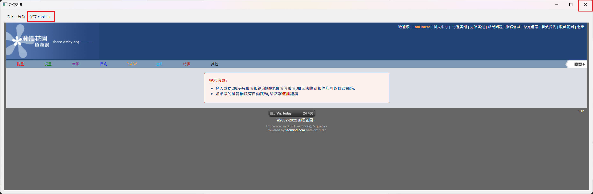
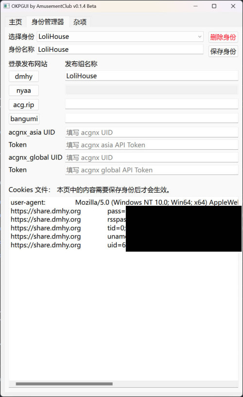
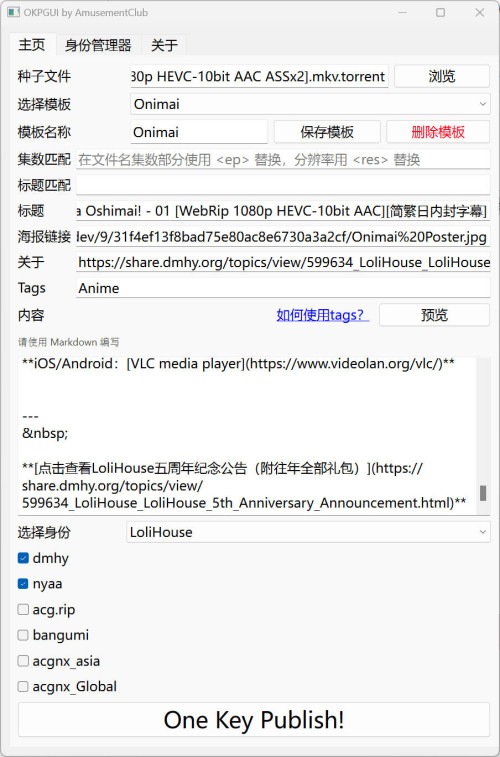

# OKPGUI
A pyqt6 gui for OKP

## 使用方法

### 快速开始

1. 将程序`OKPGUI.exe`复制到`OKP.Core.exe`的同一个文件夹下，并打开程序。
   
2. 第一次使用时，请先使用身份管理器创建一个新的身份，一个身份中包含了你的 Cookies 信息。
   点击`身份管理器`进入身份管理器页面。

   

3. 在`身份名称`一栏中给你的身份输入一个名字，例如说 `LoliHouse`。

4. 在下方的登录发布网站中，点击左边的网站按钮（例如 dmhy）可以打开网站的登录页面，打开后，输入用户名密码。在登录网站后点击`保存 Cookies`或者直接点击关闭。
   

5. 此时，你可以看到`Cookies 文件`框中多出了一些 cookies 内容。如果你不理解你在做什么，请不要手动改动它。
   
6. 一些网站有多个发布身份，你需要在网站右边的发布组名称框中填入你想选用的发布身份，例如说 `LoliHouse`。 
   
   

7. 在登完所有需要的网站之后，点击`保存身份`，使身份信息（cookies）得到保存。

8. 然后，我们可以点击`主页`回到主页，并创建一个新的模板。

9.  在一开始，我们还是在`模板名称`中给你的模板起个名字，例如说`Onimai`。

10. 点击`浏览`打开一个种子文件，或者也可以直接把种子文件拖放到窗口中。

11. 在`标题`一栏中填入发布标题，例如说`[SweetSub&LoliHouse] 不当哥哥了！/ Oniichan ha Oshimai! - 01 [WebRip 1080p HEVC-10bit AAC][简繁日内封字幕]`

12. 如果要发布在动漫花园，在`海报链接`一栏填入海报的 url，如果要发布 nyaa，可以在`关于`里面填入 about 信息。

13. `Tags`一栏可以填写标签，以逗号分隔开，例如在发布合集时填写 `Anime, Collection`。平时发布单集时填写 `Anime` 即可。该标签决定了资源在各个网站的分类，所有支持的标签和详细规则请参考 [OKP 的 wiki](https://github.com/AmusementClub/OKP/wiki/TagsConvert)。

14. `集数匹配`和`标题匹配`是选填项，其使用方法请[参考此处](#标题匹配)。

15. 在`内容`栏中使用 markdown 格式填写发布贴的详细内容，填写完毕后点击`预览`按钮可以预览其显示效果。

16. 在选择身份的选单中选择发布时使用的身份，我们选择刚才在身份管理器中创建的`LoliHouse`身份，如果需要其他的身份，请去身份管理器中创建。

17. 在下发需要发布的站点的复选框中打钩。

18. 别忘了保存此模板。

19. 点击`One Key Publish!`呼出 OKP 一键发布，在 OKP 打开的控制台中，确认发布的标题和种子文件，敲下回车键即可确认发布。



---

### 其他功能

#### 标题匹配

此功能是为了可以方便地根据种子文件名中的信息自动生成不同的发布标题。


例如说我们有一个种子文件，其名称为

`[SweetSub] Oniichan ha Oshimai! - 01 [WebRip][1080P][AVC 8bit][CHS].mp4.torrent`

然后我们还有其不同分辨率，不同集数的版本，例如说：

`[SweetSub] Oniichan ha Oshimai! - 01 [WebRip][720P][AVC 8bit][CHS].mp4.torrent`

`[SweetSub] Oniichan ha Oshimai! - 02 [WebRip][1080P][AVC 8bit][CHS].mp4.torrent`

我们不想重复地手动更改发布标题，这样非常麻烦。标题匹配功能可以在种子文件中寻找需要的信息并填写到标题中。

#### 使用方法：

在集数匹配一栏中，把文件名中的重要信息用 `<>` 标签替换，并在其中填入字符来命名，例如说

集数匹配：`[SweetSub] Oniichan ha Oshimai! - <ep> [WebRip][<res>P][AVC 8bit]`

我们再在标题匹配中以 `<>` 标签替换相应的值

标题匹配：`[SweetSub][不当哥哥了！][Oniichan ha Oshimai!][<ep>][WebRip][<res>P][AVC 8bit][简日双语][无修版]`

如果我们此时添加一个种子文件

例如 `[SweetSub] Oniichan ha Oshimai! - 01 [WebRip][720P][AVC 8bit][CHS].mp4.torrent`

程序会根据种子文件的`文件名`和`集数匹配`中的字符串来确定 `<ep>` 的值为 `01`，`<res>` 的值为 `720`

这些值会被自动代入到`标题匹配`的模板中，程序会自动生成发布标题

`[SweetSub][不当哥哥了！][Oniichan ha Oshimai!][01][WebRip][720P][AVC 8bit][简日双语][无修版]`

注意：
1. 虽然例子中只用了`<ep>`和`<res>`，但你可以使用任意数量的`<>`标签，里面可以填写任意英文单词。
2. 因为没有设置转义，所以如果发布标题中使用了`<>`，则不可以使用标题匹配的功能。
3. 程序只会在添加文件种子时，或者是在更改模板时重新计算标题。

---

## 开发、编译此程序


请先下载代码或者 clone 此 repository 到本地，然后 cd 到根目录下，使用 python 创建一个虚拟环境，并安装依赖。

```
python -m venv venv
venv\Scripts\activate.bat
pip3 install requirements.txt
```

运行 `main.py` 或者 `OKPLogic.py` 即可开始 debug。

如果需要改变 UI，请使用 [qt designer](https://build-system.fman.io/qt-designer-download) 打开 OKP.ui 或者其他 .ui 文件，在完成编辑后请调用 `Compile_UI.bat` 来将 .ui 文件编译为 .py 文件。

注意：绝对不要手动编辑编译后的 .py 文件，因为重新编译之后所有改动将会丢失。

在完成修改后可以调用 `make.bat` 将程序编译为 exe 文件。 
