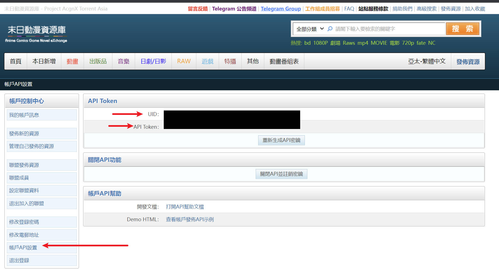
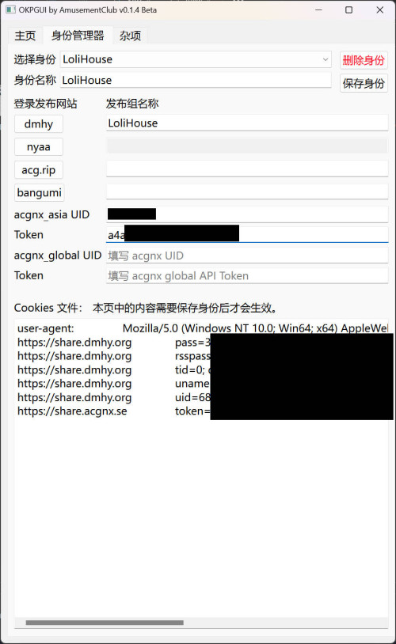
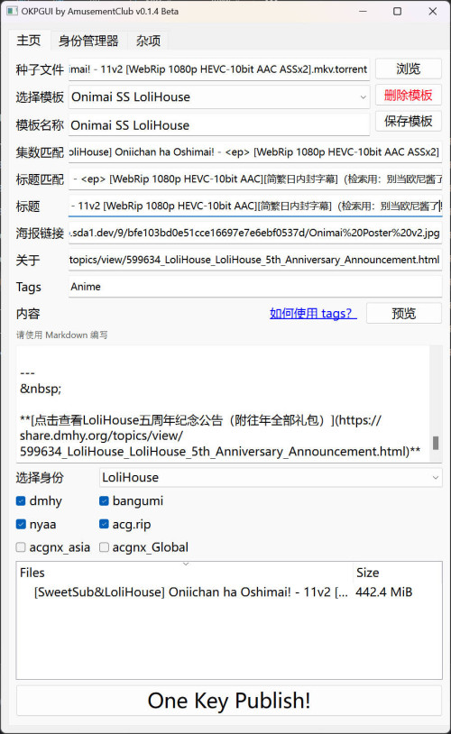

# OKPGUI

此软件为 [OKP](https://github.com/AmusementClub/OKP/) 的 GUI，由娱乐部制作，用于快速在多个 BT 资源站发布种子。

### 支持站点

_以下排名无先后_

| 站点                                          | 代号     | 
| --------------------------------------------- | ------------ | 
| [Nyaa](https://nyaa.si/)                      | nyaa         | 
| [動漫花園](https://share.dmhy.org/)           | dmhy         |
| [ACG.RIP](https://acg.rip/)                   | acgrip       |
| [末日動漫資源庫](https://share.acgnx.se/)     | acgnx_asia   | 
| [AcgnX Torrent Global](https://www.acgnx.se/) | acgnx_global |
| [萌番组](https://bangumi.moe/)                | bangumi      |

注：

1. acgrip cookie 失效后会刷新，退出登录疑似会直接失效，ua 不同也会登录失败。
2. acgnx 站点登录可能会被 Cloudflare 风控，鉴于其站点会同步 nyaa、dmhy、acgrip 的种子，可以选择不使用其上传。
3. 萌番组暂不支持自定义 TAG，目前仅支持 _Team ID_ 和 setting 中 tags 映射的分类两个 TAG。
4. **请将 Cookies 视为你的账户密码并妥善保护，任何获取到 Cookies 文件(以及`okpgui_profile.yml`)的人都可以轻易登录你的账户。**


## 使用方法

### 快速开始

1. 将程序`OKPGUI.exe`复制到`OKP.Core.exe`的同一个文件夹下，并打开程序。
   [点此下载](https://github.com/AmusementClub/OKP/releases)最新版 OKP，[点此下载](https://dotnet.microsoft.com/en-us/download/dotnet/6.0) OKP 的依赖 .NET 6 Runtime。
   > 若你使用的是非 Windows 操作系统，请将 `OKP.Core` 重命名为 `OKP.Core.exe`。
   
2. 第一次使用时，请先使用`身份管理器`创建一个新的`身份`，一个`身份`中记载了你的登录发布站的 Cookies 和 API Token。
   点击`身份管理器`进入身份管理器页面。

   

3. 在`身份名称`一栏中给你的身份输入一个名字，例如说 `LoliHouse`。

4. 在下方的登录发布网站中，点击左边的网站按钮（例如 dmhy）可以打开网站的登录页面，打开后，输入用户名密码。在登录网站后点击`保存 Cookies`或者直接点击关闭。
   

5. 此时，你可以看到`Cookies 文件`框中多出了一些 cookies 内容。如果你不理解你在做什么，请不要手动改动它。
   
6. 一些网站有多个发布身份，你需要在网站右边的发布组名称框中填入你想选用的发布身份，例如说 `LoliHouse`。 
   
   

7. 对于 [acgnx_asia](https://share.acgnx.se/) 和 [acgnx_global](https://www.acgnx.se/)，请前往「发布资源 - 账户 API 设置」中，将 UID 和 API Token 填入对应的文本框中。注意，在填写后必须点击`保存身份`才会生效。

   

   

8. 在登录完所有需要的网站之后，点击`保存身份`，使身份信息得到保存。

9.  然后，我们可以点击`主页`回到主页，并创建一个新的模板。

10. 在一开始，我们还是在`模板名称`中给你的模板起个名字，例如说`Onimai`。

11. 点击`浏览`打开一个种子文件，或者也可以直接把种子文件拖放到窗口中。

12. 在`标题`一栏中填入发布标题，例如说`[SweetSub&LoliHouse] 不当哥哥了！/ Oniichan ha Oshimai! - 01 [WebRip 1080p HEVC-10bit AAC][简繁日内封字幕]`

13. 如果要发布在动漫花园，在`海报链接`一栏填入海报的 url，如果要发布在 nyaa.si，可以在`关于`里面填入 about 信息。

14. `Tags` 决定了资源在各个网站的分类，所有支持的标签和详细规则请参考 [OKP 的 wiki](https://github.com/AmusementClub/OKP/wiki/TagsConvert)。
    > 在填写时以逗号分隔开，例如在发布合集时填写 `Anime, Collection`（逗号后是否空格不会影响程序判断）。平时发布单集时填写 `Anime` 即可。
    > 注意： **这不是 bangumi.moe 的 tag 系统。**

15. `集数匹配`和`标题匹配`是选填项，其使用方法请[参考此处](#标题匹配)。

16. 在`内容`栏中使用 **markdown** 格式填写发布贴的详细内容，填写完毕后点击`预览`按钮可以预览其显示效果。

      > 暂不支持用户使用 html 或 bbcode

17. 在`选择身份`的选单中选择发布时使用的身份，在此例子中，我们选择刚才在身份管理器中创建的`LoliHouse`身份，如果需要其他的身份，请移步至身份管理器中创建。

18. 在下方需要发布的站点的复选框中打钩。
    > 如果发现某个网站不能打钩，说明选择的身份中并没有添加这个网站的信息（Cookies/API Token），请移步身份管理器中编辑身份。

      

19. 发布时不需要保存模板，程序会根据目前文本框中的内容和选项来发布，也就是说，即使有模板，但每次发布前也可以手动微调发布标题或者是内容等。如果想要下次重复利用此发布模板，请别忘记了保存模板。

20. 点击`One Key Publish!`呼出 OKP 一键发布，在打开的控制台中，确认发布的标题和种子文件准确无误后，点击确定按钮即可发布。

      


---

### 其他功能

#### 1. 标题匹配

此功能是为了可以方便地根据种子文件名中的信息自动生成不同的发布标题。


例如说我们有一个种子文件，其名称为

```
[SweetSub] Oniichan ha Oshimai! - 01 [WebRip][1080P][AVC 8bit][CHS].mp4.torrent
```

然后我们还有其不同分辨率，不同集数的版本，例如说：

```
[SweetSub] Oniichan ha Oshimai! - 01 [WebRip][720P][AVC 8bit][CHS].mp4.torrent
[SweetSub] Oniichan ha Oshimai! - 02 [WebRip][1080P][AVC 8bit][CHS].mp4.torrent
```

我们不想重复地手动更改发布标题，这样非常麻烦。标题匹配功能可以在种子文件中寻找需要的信息并填写到标题中。

##### 使用方法：

在集数匹配一栏中，把文件名中的重要信息用 `<>` 标签替换，并在其中填入字符来命名，例如说

**集数匹配**：
```
[SweetSub] Oniichan ha Oshimai! - <ep> [WebRip][<res>P][AVC 8bit]
```

我们再在标题匹配中以 `<>` 标签替换相应的值

**标题匹配**：
```
[SweetSub][不当哥哥了！][Oniichan ha Oshimai!][<ep>][WebRip][<res>P][AVC 8bit][简日双语][无修版]
```

如果我们此时添加一个种子文件

例如:
```
[SweetSub] Oniichan ha Oshimai! - 01 [WebRip][720P][AVC 8bit][CHS].mp4.torrent
```

程序会根据种子文件的`文件名`和`集数匹配`中的字符串来确定 `<ep>` 的值为 `01`，`<res>` 的值为 `720`

这些值会被自动代入到`标题匹配`的模板中，程序会自动生成发布标题：

```
[SweetSub][不当哥哥了！][Oniichan ha Oshimai!][01][WebRip][720P][AVC 8bit][简日双语][无修版]
```

注意：
1. 虽然例子中只用了`<ep>`和`<res>`，但你可以使用任意数量的`<>`标签，里面可以填写任意英文单词。
2. 因为没有设置转义，所以如果发布标题中使用了`<>`，则不可以使用标题匹配的功能。


#### 2. 代理

为了方便对抗 GFW，程序内置了 HTTP 代理功能。

在`杂项`选项卡中选择代理类型 HTTP，并且在 Host 一栏中填入 HTTP 代理的地址，例如说 `http://127.0.0.1:7890`，然后点击`保存身份`，即可在访问网站时使用代理，同时，该代理也会直接传给 OKP.Core 所使用。

注意，代理的改动必须点击`应用`后才会生效。


---

## 开发、编译此程序


请先下载代码或者 clone 此 repository 到本地，然后 cd 到根目录下，使用 python 创建一个虚拟环境，并安装依赖。

```
python -m venv venv
venv\Scripts\activate.bat
pip3 install requirements.txt
```

运行 `main.py` 或者 `OKPLogic.py` 即可开始 debug。

如果需要改变 UI，请使用 [qt designer](https://build-system.fman.io/qt-designer-download) 打开 OKP.ui 或者其他 .ui 文件，在完成编辑后请调用 `Compile_UI.bat` 来将 .ui 文件编译为 .py 文件。

注意：绝对不要手动编辑编译后的 .py 文件，因为重新编译之后所有改动将会丢失。

在完成修改后可以调用 `make.bat` 将程序编译为 exe 文件。 

----

## 常见问题

1. 为什么无法勾选某发布网站？

   如果发现某个网站不能打钩，说明选择的身份中并没有添加这个网站的信息（Cookies/API Token），请移步身份管理器中编辑身份。

2. 在设置好了 cookies 之后无法访问某个发布站

   a. 请检查是否下载最新版的 OKP.Core。
   b. 尝试删除身份管理器中发布站对应的 cookies 信息，点击保存身份，然后重新登录。

3. 能否让用户自行提交发布站所需的 html, bbcode 发布内容？

   作者认为 Less is more，简单的 Markdown 足够满足一般的排版需求。
   所以暂时不会加入提交 html, bbcode 的功能。
   如有此功能的需求，可以使用 OKP.Core 的 CLI。

4. 有 Bug
   
   去[此页面](https://github.com/AmusementClub/OKPGUI/issues/new/choose)创建一个 issue 并选择 Bug report，请尽量准确地描述要如何重现此 bug。

5. 想要新功能

   去[此页面](https://github.com/AmusementClub/OKPGUI/issues/new/choose)创建一个 issue 并选择 Feature request。